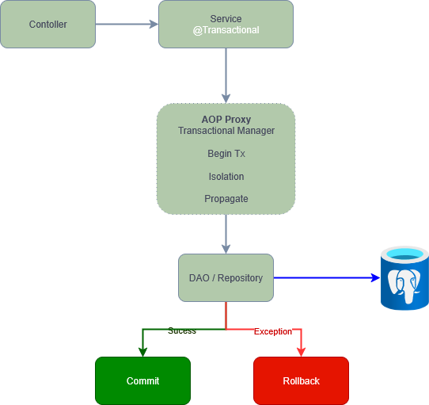

# Spring boot Transaction

A `transaction` is a sequence of multiple statements that must either `all succeed or all fail`. If one step fails, everything gets `rolled back`.



## ACID Properties

* `A — Atomicity:` All or nothing.
    If any part fails, the whole transaction is rolled back.
* `C — Consistency:` Rules Respected
    Your database should always stay valid — it should move from one valid state to another.
* `I — Isolation:` Do it like you are alone
    Multiple transactions shouldn’t interfere with each other.
* `D — Durability:` Written in Stone
    Once the transaction is committed, the changes are permanent, even if the system crashes.

Spring’s `@Transactional` is responsible for transaction boundaries

* Starting a transaction before your method runs
* Committing it if the method completes successfully
* Rolling back if a runtime exception is thrown

## How does Spring work internally?

Spring uses `AOP (Aspect-Oriented Programming)` to wrap your service method in extra behavior — in this case, transaction management.

When your service is marked with `@Transactional`, Spring does the following:

    Creates a proxy around your class or method
    When a method is called:
    — It begins a transaction
    — Runs your business logic
    — Commits or rolls back based on success or failure

    Spring uses:
    — `JDK Dynamic Proxies` if your class implements an interface `CGLIB proxies` if it doesn’t

This allows Spring to manage transactions without modifying your core logic.

Now,

    💡 Clear and clean business logic
    🔄 Reusable, declarative transaction control
    🛡 Safe rollback on exceptions
    📦 Less boilerplate, more focus

## Where Can You Add `@Transactional`?

You can use it in two ways:

### Method Level

Add `@Transactional` on top of a `public` method. Only public methods can be proxied by Spring. If you add it to `private or protected` methods, it `won’t work`, because Spring can’t create proxies for them.

### Class Level

Add `@Transactional` At the class level, Spring will apply it to all public methods within that class.

By default, Spring rolls back only for unchecked exceptions (subclasses of RuntimeException or Error).

If your method throws a checked exception, the transaction will not be rolled back — unless you explicitly configure it:

```java
@Transactional(rollbackFor = Exception.class)
```